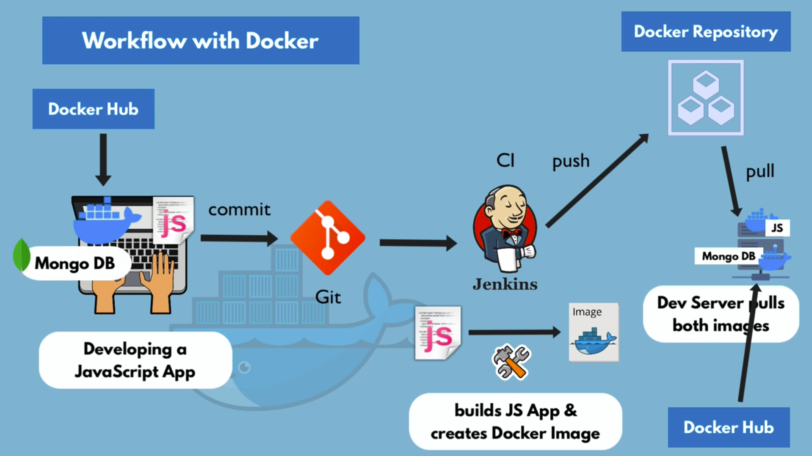

# DOCKER


<p align="center">Docker in real life environment</p>

Download and install docker from [Docker](https://www.docker.com)

Verify the download using following command docker version should display in console
```
docker -v
```

## Docker Image
It is a blueprint of container, like class and objects where Image acts as a class and containers are objects

## Container
contains all the applications and resources that are needed for a project.

let's say we're using following modules
- mongodb v3
- node v19
and what not !

Let's say I am using node v19 and my teammate is using node v18. That's where docker kicks in and make the environment consistent, a dockerfile works as a package.json to setup the project environment

It eliminates `"It works on my machine problem"`

- They're portable
- They're light-weight
- They're isolated from local environment

---

# Docker Commands

## To `pull` an image from hub.docker.com
```
docker pull IMAGE_NAME
```
Example:
```
docker pull hello-world
```

---

## To `pull` an image from hub.docker.com with version
```
docker pull IMAGE_NAME:version
```
Example:
```
docker pull mysql:8.0
```

---

## To `list` all the images
```
docker images
```

## `Execute` an image 
```
docker run IMAGE_NAME
```
Example
```
docker run hello-world
```
Example: Detached mode
```
docker run -d hello-world
```
`Note`:  if you need to monitor the output of a container or interact with it, attached mode is more appropriate. `The attached mode actively occupy the terminal`.

---

## `Run` a image in `interactive mode`
```
docker run -it IMAGE_NAME
```
Example: This will start a ubuntu console 
```
docker run -it ubuntu
```

`NOTE`: Docker run is used to create new containers out of the images `Docker start` is used to run existing containers with name or ID.

---

## `Run a image` assigning a name of container
```
docker run [-it] --name name IMAGE_NAME
```
---

## `Exit/Stop` the container in `interactive mode`
```
exit
```
---

## `List all containers`
```
docker ps -a
```
---

## `List all containers` that are `running`
```
docker ps
```
---

## `Run existing containers`
```
docker start ( CONTAINER_NAME || CONTAINER_ID )
```
Example: starting a container with name
```
docker start quirky_sanderson
```
Example: starting a container with ID
```
docker start 6cb01cd7814f (Initial 6-7 bits of long ID)
```
Example: starting a container in interative mode
```
docker start -i 6cb01cd7814f (Initial 6-7 bits of long ID)
```
---

## `STOP running containers`
```
docker stop ( CONTAINER_NAME || CONTAINER_ID )
```
Example: stopping a container with name
```
docker stop quirky_sanderson
```
Example: stopping a container with ID
```
docker stop 6cb01cd7814f (Initial 6-7 bits of long ID)
```
---

## `Removing Images`
`Note`: Containers with the image must be removed first 
```
docker rm container_name
```
## removing images
```
docker rmi image_name
```
---

## PORT BINDING

`Note`: PORT in containers differ from the host machine. To map the container ports with host machine we can use following commands

```
docker run -p HOST_PORT:CONTAINER_PORT IMAGE NAME
```
Example:
```
docker run -p5173:5174 reactENV
```

## Setting ENV variable

```
docker run -e VAR_NAME=VAR_VALUE CONTAINER_NAME (or container_id)
```
Example:
```
docker run -e PORT=5000 reactENV
```

---


## Going to bin/bash of a container
`Note`: you have to start the container before creating the bash
```
docker exec -it CONTAINER bin/bash
```
Example:
```
docker run -e node:latest bin/bash
```
---

## Composing a docker image

`Docker network` is automatically made out of compose.yaml

> docker compose -f compose.yaml up -d

> docker compose -f compose.yaml down

## Volumes - preserving data